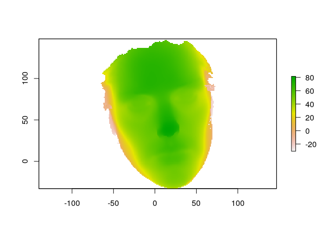

<!-- README.md is generated from README.Rmd. Please edit that file -->

# mesh2ray

The goal of mesh2ray is to transform mesh3d to objects that can be used
with [‘rayshader’](https://github.com/tylermorganwall/rayshader) or
[‘rayrender’](https://github.com/tylermorganwall/rayrender).

## Installation

You can install the released version of {mesh2ray} from Github

``` r
#install.packages("remotes")
remotes::install_github("statnmap/mesh2ray")
```

## Play with mesh3d and ray’s

``` r
library(mesh2ray)
library(raster)
#> Loading required package: sp
library(Rvcg)
data(humface)
```

## Transfrom mesh3d to raster

``` r
r <- mesh_to_raster(humface)
plot(r)
```



Please note that the ‘mesh2ray’ project is released with a [Contributor
Code of Conduct](CODE_OF_CONDUCT.md). By contributing to this project,
you agree to abide by its terms.
